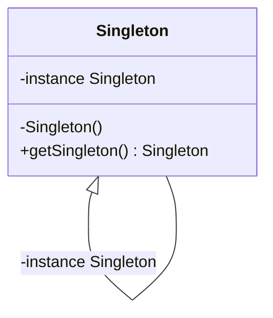

> ensures a class only has one instance, and provide a global point of access to it.
This is useful when exactly one object is needed to coordinate actions across the system.


```java
static Singleton getInstance() {
if(instance == null) {
    instance = new Singleton()
}
return instance
}
```

The **Singleton** class declares the static method `getInstance` that returns the same instance of its own class.

The Singleton’s constructor should be hidden from the client code. Calling the `getInstance` method should be the only way of getting the Singleton object.

## Applicability

Use the Singleton pattern when

-   There must be exactly one instance of a class, and it must be accessible to clients from a well-known access point
-   When the sole instance should be extensible by subclassing, and clients should be able to use an extended instance without modifying their code

Some typical use cases for the Singleton

-   The logging class
-   Managing a connection to a database
-   File manager
-   `java.lang.Runtime` and `java.awt.Desktop`

## Consequences

-   Violates [[Single Responsibility Principle]] (SRP) by controlling their creation(Ensure that a class has just a single instance) and lifecycle(Provide a global access point to that instance).
-   Encourages using a globally shared instance which prevents an object and resources used by this object from being deallocated.
-   Creates tightly coupled code. The clients of the Singleton become difficult to test  because many test frameworks rely on inheritance when producing mock objects. Since the constructor of the singleton class is private and overriding static methods is impossible in most languages, you will need to think of a creative way to mock the singleton. Or just don’t write the tests. Or don’t use the Singleton pattern.
-   Makes it almost impossible to subclass a Singleton.
-   The pattern requires special treatment in a multithreaded environment so that multiple threads won’t create a singleton object several times.

## Relations to other pattern

-   A [[Facade |Facade]] class can often be transformed into a [[Singleton]] since a single facade object is sufficient in most cases.
    
-   [[Flyweight]] would resemble [[Singleton]] if you somehow managed to reduce all shared states of the objects to just one flyweight object. But there are two fundamental differences between these patterns:
    
    1.  There should be only one Singleton instance, whereas a _Flyweight_ class can have multiple instances with different intrinsic states.
    2.  The _Singleton_ object can be mutable. Flyweight objects are immutable.
-   [[Abstract factory]], [[Builder]] and [[Prototype]] can all be implemented as [[Singleton]].
