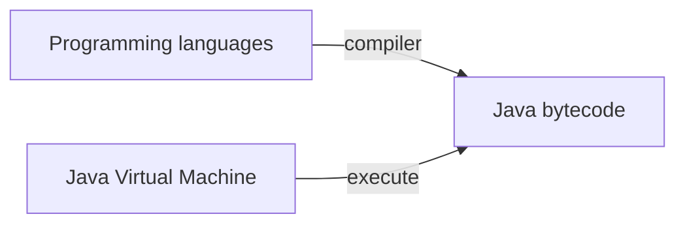

-   Languages: java, scala, clojure, jRuby, etc
-   Bytecode is an instruction set of one-byte opcodes
-   Java bytecode is executes by the JVM

##### Why Scala?

```java
// java
public class Time {
	private final int hours;
	private final int minutes;

	public Time(int hours, int minutes) {
		this.hours = hours;
		this.minutes = minutes;
	}

	public int getHours() {
		return hours;
	}

	public int getMinutes() {
		return minutes;
	}
}
```
```scala
// scala
class Time(val hours: Int, val minutes: Int)
```

-   Statically typed, yet lightweight
-   Object-oriented and functional: Pick the right tools for the job
-   Scalable language: perfect fit for typessafe SDLs
-   Stable yet innovative
-   Fully interoperable with java

immutable values
```
val message = "Hello"
message: String = Hello

message = "Halo"
error message
```
An immutable value is defined  with the val keyword

##### First steps in scala

The REPL

-   The read ecal print loop is an interactive shell started via
	-   Scala from the command line
	-   Console in sbt
-   Compiled and evaluated scala code immediately
-   Very helpful for experiment-driven development

Useful repl commands

`:cp <path>` add a jar or directory to the classpath
`:help [command]` print thus summary or command specific help
`:history [num]` show the history
`:javap <path|class>` disassemble a file or class name
`:load <path>` load and interpret a Scala file
`:paste` enter paste mode: all input up to ctrl-D compiled togther
`:quit` exit the interpreter
`:replay` reset execution and replay all previous commands
`:reset` reset the repl to its initial state, forgetting all session entries
`:sh` <command line> run a shell command (result is implicit => List[String])
`:warnings` show the suppressed warning from the most recent line

Expression oriented programming
-   A statement get executed with no return value, purely for its side effects
-   An expression gets evaluated to a value