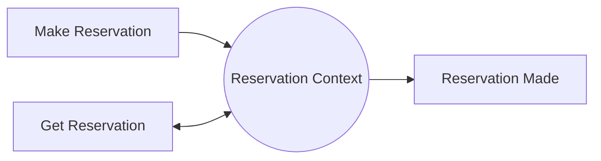
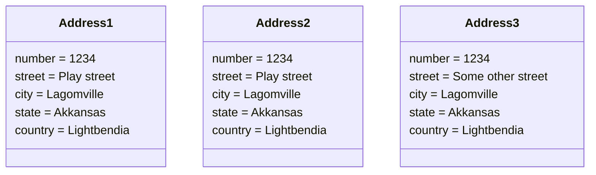

### Domain activities
Commands:
-   Command are a type of activity that occurs in the domain
-   Represents a request to perform an action
-   The action has not yet happened and can be rejected
-   Usually delivered to a specific destination
-   Causes a change in the state of the domain
-   Ex add item to an order

Events:
-   Events are another activity in the domain
-   They represent an action that has happened in the past
-   Because the action is already completed they cannot be rejected
-   Often broadcasts to many destinations
-   Record a change to the state of a domain. Often the result of a command
-   Ex an item was added to an order

Queries:
-   Queries are the final type of activities in the domain
-   They represent a request for information about the domain
-   Because they are a query the respond is always expected
-   Usually delivered to a specific destination
-   Queries should not alter the state of a domain
-   Ex get details of an order, check if bill has been paid

commands, events, queries in a reactive system:

-   Commands, events, and queries are the messages in a reactive system
-   They form the API for a bounded context or microservice

fter analyzing various activities in our domain we have settled on a set of Bounded Contexts that includes:

-   Orders - Manages the contents of an order, and the lifecycle of the order.
-   Reservations - Handles reservations for tables, as well as marking tables as occupied.
-   Payments - Deals with collecting and recording payment details for orders.
-   Menu - Contains details about menu items, including their descriptions, photos, prices etc.
-   Customers - Manages customer personal data (name, phone number, address etc).

There may be other Bounded Contexts necessary for the system to function, but this gives us a starting point.

In the next few case study exercises, we are going to focus in on just the Orders Bounded Context.

As we dive into the Orders context we will begin to show how you might represent activities in code. To do that, when we present an activity, we will include the name of a class or object that would appear in the code. This will demonstrate how our Ubiquitous Language translates into the actual code. For example:

Open an Order (OpenOrder)

Here, the Command is "Open an Order". This is using domain terminology and we could talk to our domain experts about how we "Open an Order" and they would be able to grasp what we are talking about. When we translate that into code we use a class name such as "OpenOrder" or even "OpenAnOrder". This allows us to maintain the Ubiquitous Language in the code.

Commands represent a request to change the state of the domain. They can be rejected and are usually phrased as a request.

A best practice is to define Commands that are intent revealing. This means that you can see from looking at the Command exactly what it was trying to do. We should therefore favour Commands that are more specific, rather than more general.

Events are often the result of a Command. Where a Command requests a change to the state of the domain, and Event records that change. They often exist in a 1 to 1 relationship with the Command. Because they record something that happened in the past, they are best written as past tense. Like Commands, Events are best when they reveal intent.

### Domain Objects

Value objects
