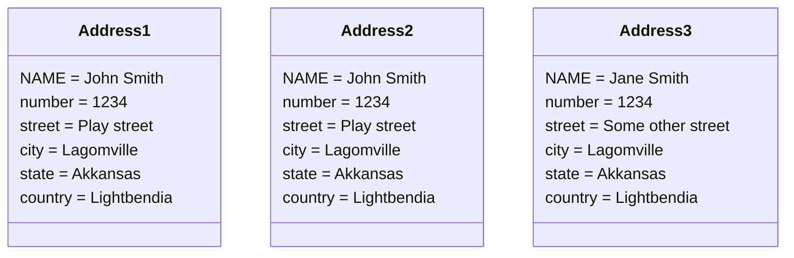
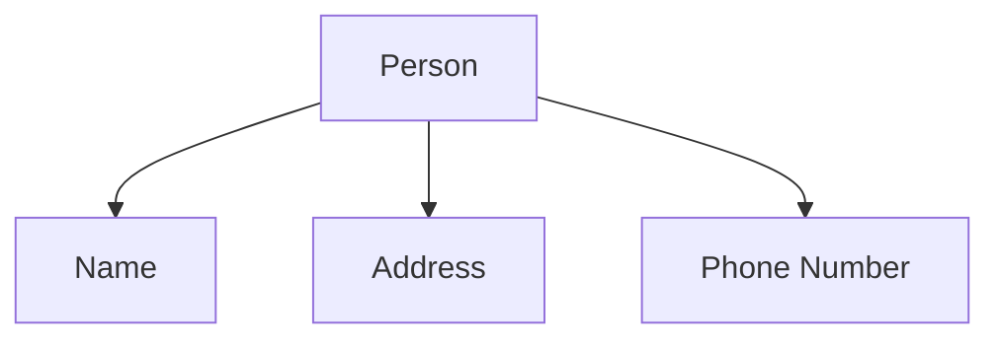
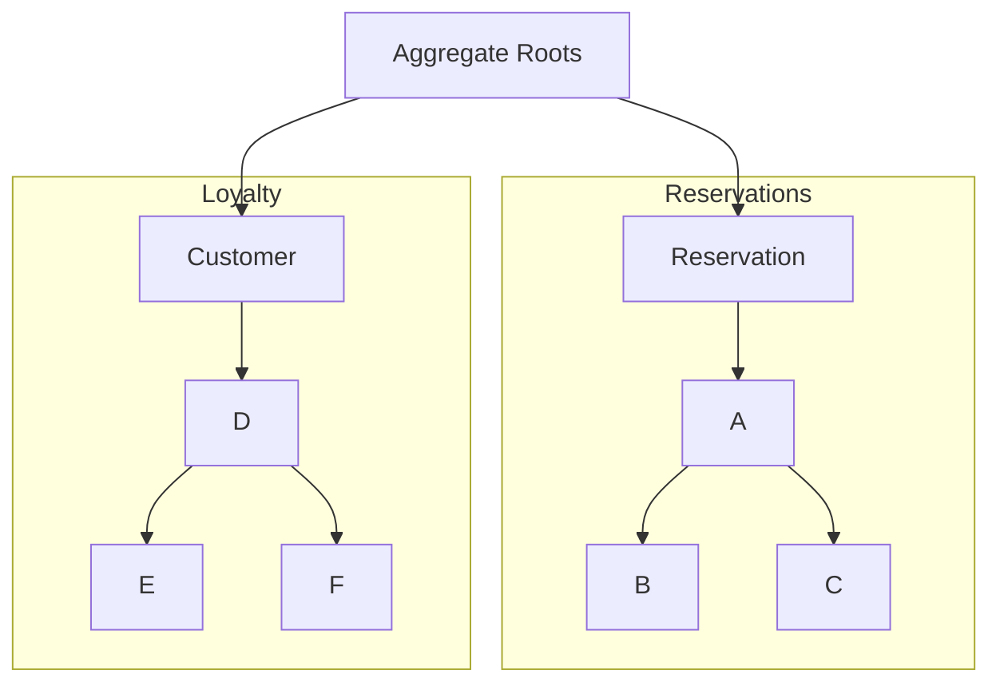

### Domain activities
Commands:
-   Command are a type of activity that occurs in the domain
-   Represents a request to perform an action
-   The action has not yet happened and can be rejected
-   Usually delivered to a specific destination
-   Causes a change in the state of the domain
-   Ex add item to an order

Events:
-   Events are another activity in the domain
-   They represent an action that has happened in the past
-   Because the action is already completed they cannot be rejected
-   Often broadcasts to many destinations
-   Record a change to the state of a domain. Often the result of a command
-   Ex an item was added to an order

Queries:
-   Queries are the final type of activities in the domain
-   They represent a request for information about the domain
-   Because they are a query the respond is always expected
-   Usually delivered to a specific destination
-   Queries should not alter the state of a domain
-   Ex get details of an order, check if bill has been paid

commands, events, queries in a reactive system:

-   Commands, events, and queries are the messages in a reactive system
-   They form the API for a bounded context or microservice

fter analyzing various activities in our domain we have settled on a set of Bounded Contexts that includes:

-   Orders - Manages the contents of an order, and the lifecycle of the order.
-   Reservations - Handles reservations for tables, as well as marking tables as occupied.
-   Payments - Deals with collecting and recording payment details for orders.
-   Menu - Contains details about menu items, including their descriptions, photos, prices etc.
-   Customers - Manages customer personal data (name, phone number, address etc).

There may be other Bounded Contexts necessary for the system to function, but this gives us a starting point.

In the next few case study exercises, we are going to focus in on just the Orders Bounded Context.

As we dive into the Orders context we will begin to show how you might represent activities in code. To do that, when we present an activity, we will include the name of a class or object that would appear in the code. This will demonstrate how our Ubiquitous Language translates into the actual code. For example:

Open an Order (OpenOrder)

Here, the Command is "Open an Order". This is using domain terminology and we could talk to our domain experts about how we "Open an Order" and they would be able to grasp what we are talking about. When we translate that into code we use a class name such as "OpenOrder" or even "OpenAnOrder". This allows us to maintain the Ubiquitous Language in the code.

Commands represent a request to change the state of the domain. They can be rejected and are usually phrased as a request.

A best practice is to define Commands that are intent revealing. This means that you can see from looking at the Command exactly what it was trying to do. We should therefore favour Commands that are more specific, rather than more general.

Events are often the result of a Command. Where a Command requests a change to the state of the domain, and Event records that change. They often exist in a 1 to 1 relationship with the Command. Because they record something that happened in the past, they are best written as past tense. Like Commands, Events are best when they reveal intent.

### Domain Objects

Value objects

Address1 == Address2 != Adress3

-   A value object is defined by its attributes
-   Two value objects are equivalent if their values are the same
-   Value objects are IMMUTABLE
-   In addition to state, value objects can contain business logic
-   Messages in reactive systems are implemented as value objects

Entities

Address1 == Address2 != Adress3
NAME is the identity

-   An entity is defined by a unique identity
-   An entity may change its attributes but not its identity
-   If the identity changes it is a new entity, regardless of its attributes
-   Entities are the single source of truth for a particular id
-   Entities can also contain business logic
-   Actors in Akka and Entities in Lagom

Aggregate


-   An aggregate is a collection of domain objects bound to a root Entity
-   The root Entity is called the Aggregate root
-   Objects in an Aggregate can be treated as a single unit
-   Access to objects in the aggregate must go through the aggregate root
-   Transactions should not span multiple Aggregate roots
-   Aggregates are good candidates for distribution in reactive systems



-   Choosing an aggregate root is not always straightforward
-   The aggregate can be different from one context to the other
-   Some contexts may require multiple aggregate roots
-   Questions to consider:
	-   Is the entity involved in most operations in that bounded context?
	-   If you delete the entity does it require you to delete other entities?
	-   Will a single transaction span multiple entities?
		-   Yes? Then that candidate is not suitable for a aggregate root

Domain abstractions

```mermaid
flowchart LR
Mail1["Mail"]-->ES["Email Sender"]---SES["SMPT Email Sender"]---Mail2["Mail"]-->Cloud[("Cloud")]
Abstrac.->ES
Concrete.->SES
```

-   Business logic doesn't always fit with an entity or value object
-   This logic can be encapsulated by a service
-   Services should be stateless
-   Often used to abstract away an anti-corruption layer
-   Note: too many services leads to an anemic domain. Look for a missing domain object before resorting to a service

Factories

```mermaid
flowchart TB
CR["Create reservation"]-->RF["Reservation Factory"]---CRF["Cassandra reservation factory"]-->C[("Cassandra")]
Abstract.->RF
Concrete.->CRF
```
-   Logic to construct new domain objects may not be trivial
-   May require access to external resources(databases, files, REST API, etc)
-   Factories abstract away the logic of creation
-   Usually implemented as a domain interface, with one or more concrete implementations

Repositories
```mermaid
flowchart TB
GR["Get reservation"]-->RR["Reservation Repository"]---FRR["File based reservation repository"]-->FS[("File system")]
Abstract.->RR
Concrete.->FRR
```
-   Similar to factories, repositories abstract away the retrieving of existing objects
-   Factories are used to get new objects, repositories are used to get, or modify existing objects
-   Often operate as abstraction layers over databases, but they can work with fles, rest apis etc.
-   Note: a repository does not automatically imply a database

A note on factories and repositories:
-   Factories and repositories are related. For this reason, they are often combined
-   A repository may end up with all of the CRUD operations
-   Tools like Akka and Lagom are powerful because they provide facilities that abstract away the need for repositories
-   Implementation of Repositories in Akka or Lagom is done through plugins.