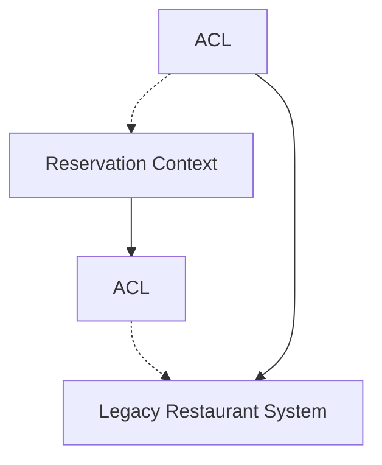
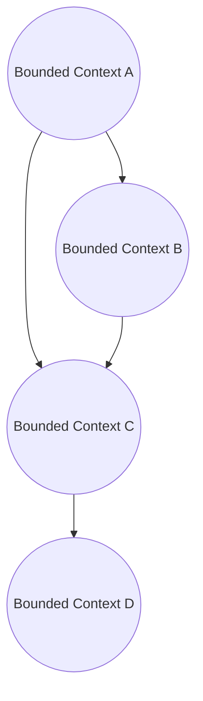

Domain driven design is highly compatible with reactive architecture.

Large domains are difficult to model. Trying to fit it in one coherent model can be very difficult or impossible.

We try to break up the large domain into smaller pieces to help us determine the boundaries of that domain.

reactive microservices specifically, have a similar goal: they need to be separated along clear boundaries. In the case of reactive microservices those boundaries need to be asynchronous: each microservice has to have a clearly defined API and a specific set of responsibilities. The broken up logic can be applied to the microservices.

### What is a domain?

Domain:
-   In the context of software it refers to the business or idea that we are modeling
-   Experts in the domain are the people that understand the business
-   The key goal of DDD is to build a model that the domain experts understand
-   The model is not the software:
	-   The model represents our understanding of the domain
	-   The software is an implementation of the model
	-   Other forms of implementations could be diagrams, documentation around the model etc.

Ubiquitous Language:

-   Communication between developers and domain experts requires a common language
	-   The language is called Ubiquitous language
-   Terminology in the ubiquitous language comes from the domain expert
	-   Words originate in the domain and are used in the software
		-   Try to understand the words they use and use in model
	-   Avoid taking software terms and introducing it into the domain
		-   Exceptions for when there is an abstraction in the software. The developer should talk to the domain expert to give it a name
-   Domain experts and developers should be able to have a conversation without resorting to software terms

### Decomposing the domain

large domains:
-   Business domains are often large and complicated
-   Contain many ideas, actions and rules that interact in complex ways
-   Trying to model a large domain becomes problematic

subdomains:
-   Large domains may be separated into subdomains
-   Subdomains are created by grouping related ideas, actions and rules
-   Some concepts may exist in multiple domains
	-   Shared concepts may not be identical initially
	-   They may also evolve differently
	-   Avoid the temptation to abstract
		-   Example customer in a subdomain may have details that is not important to another subdomain that customer is part of and vice versa

Bounded contexts:
-   Each subdomain has its own ubiquitous language and model
-   The language and model for a subdomain is called a bounden context
-   Subdomains and bounded contexts are a good starting point for building reactive microservices

How to determine bounded contexts:
-   No universal answer but here are some guidelines
-   Consider human culture and interaction
	-   Different areas of the domain that are handled by different groups of people, suggests a natural division
-   Look for changes in ubiquitous language
	-   If the use of language or the meaning of that language changes, that may suggest a new context
-   Look for varying or unnecessary information
	-   Employee id is very important for an employee and not for a customer
-   Strongly separated bounded contexts will result in smooth workflows
	-   An awkward workflow may signal a misunderstanding of the domain
	-   If a bounded context has too many dependencies it may be too complex

Event first domain driven design:
-   Traditionally, domain driven design focused on the objects within the domain
	-   Ex cook, reservation, customer etc
-   Event first domain driven design places the focus on the activities or events that occur in that domain
	-   Ex. Customer makes a reservation, server places an order, food is served to the customer
-   Using event first DDD we start by defining the activity, then group those activities to find logical system boundaries

When initially defining microservices, it's often a good idea to start with your bounded contexts: one bounded context = one microservice.

One bounded context does not equal one  microservice.

When defining our activities, it can be useful to use a common notation to help keep your activities clear. For this exercise we will use subject-verb-object notation. Our subject represents whoever is doing the particular activity. Our verb is the action being done. Our object is the target of that action, i.e. the object that the action is being applied to. For example

Host creates a Reservation

Here, our subject is "Host", our verb is "creates" and our object is "Reservation".

When defining these activities, it is important to think about how the business would operate in the absence of software. We want to be careful not to allow the implementation of the software, to leak into our domain model.

### Maintaining purity

```mermaid
flowchart LR
ACL.->ReservationContext
CustomerContext-->ACL
```

-   Each bounded context may have domain concepts that are unique
-   Concepts aren't always compatible from one context to the next
-   Anti-corruption layers(ACL) are introduced to translate these concepts
-   An anti-corruption layer will prevent bounded contexts from leaking into each other
-   Anti-corruption layers help the bounded context to stand alone

Anti-corruption for legacy systems



-   Sometimes you interface with a legacy system
-   The domain of the legacy system may be messy or unclear
-   An anti-corruption layer keeps your bounded context pure
-   It prevents your domain from dealing with the mess of the legacy system
-   ACL may be implemented in the legacy system, or In a bounded context or both

context maps:


-   Context maps are a way of visualizing bounded contexts and the relationship between them
-   Bounded contexts are drawn as simple shapes
-   Line connect the bounded context to indicate relationship
-   Lines may be labeled to indicate nature of relationship
- 
In order to allow you to engage in the process of determining Bounded Contexts without going too deep, we have presented a simplified approach. If you are interested in exploring Bounded Contexts in more detail then we would strongly recommend you explore a standard practice such as Event Storming: [https://en.wikipedia.org/wiki/Event_storming](https://en.wikipedia.org/wiki/Event_storming)

