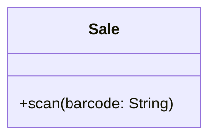
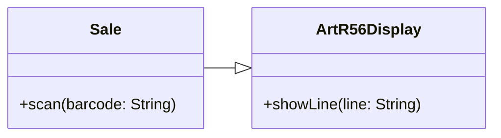
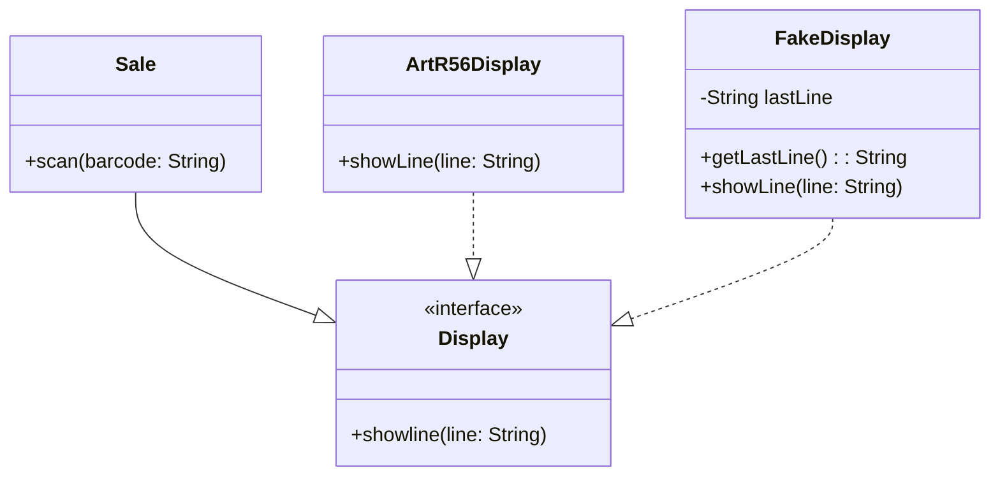
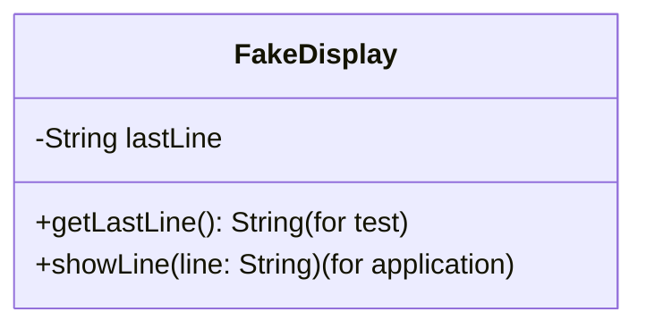

In systems that do not have unit tests in place we often have to break dependencies to get the system into a test harness. Most of the times these classes that we want to change have an effect on other classes and the tests need to know about them. Sometimes we can sense those effects through the interface of the other class. At other times, we can’t. The only choice we have is to impersonate the other class so that we can sense the effects directly.

when we want to get tests in place, there are two reasons to break dependencies: sensing and separation
-   Sensing
	-   We break dependencies to sense when we can’t access values our code computes.
-   Separation
	-   We break dependencies to separate when we can’t even get a piece of code into a test harness to run

### Faking collaborators

Dependencies -> biggest problems in legacy code.

To see what a code does dependencies need to be broken.
We can add another piece of code in the place of the dependency to test the code. This is referred to as a fake object.

### Fake objects

Fake object -> impersonates some collaborator of a class when it is being tested.
Example case and a fake object

sale

sale communjcating with a display class

In a point-of-sale system, we have a class called Sale (see Figure 3.1). It has a method called scan() that accepts a bar code for some item that a customer wants to buy. Whenever scan() is called, the Sale object needs to display the name of the item that was scanned, along with its price on a cash register display.

How can we test this to see if the right text shows up on the display? Well, if the calls to the cash register’s display API are buried deep in the Sale class, it’s going to be hard. It might not be easy to sense the effect on the display.

The nice thing about having a fake display is that we can write tests against it to find out what the Sale does.

### Two sides of a fake object

A fake object has 2 sides:

1.  Functionality that is used by another class
2.  Functionality that is meant for the test

